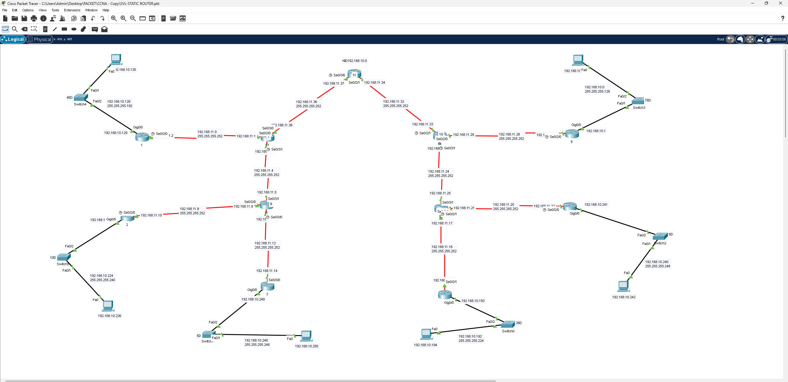

# SVL Static Router – شبكة كبيرة موزعة بتوجيه ساكن

## 📖 الوصف
مشروع توجيه ساكن على شبكة كبيرة الحجم بتصميم شجري (Tree Topology) يربط أكثر من 10 راوترات موزعة على فرعين رئيسيين، بعناوين من شبكة `192.168.10.0` و `192.168.11.0` مقسّمة بـ VLSM.

## 🗺️ التصميم (Topology)

- شبكتان رئيسيتان (يمين ويسار) تتفرعان لعدة راوترات فرعية عبر روابط Serial بأقنعة `/30`
- كل راوتر فرعي يخدم شبكة LAN مستقلة (`192.168.10.x` أو `192.168.11.x`) عبر سويتش وجهاز PC

## ⚙️ المفاهيم المطبقة
- تصميم شبكة هرمية (Hierarchical) بفرعين رئيسيين متعددي المستويات
- استخدام **VLSM** لتوزيع عناوين الشبكتين الرئيسيتين على عشرات الشبكات الفرعية
- كتابة جداول توجيه ساكن كاملة تربط جميع الفروع ببعضها البعض
- التحقق من الاتصال الشامل (End-to-End) عبر مسارات متعددة القفزات (Multi-hop)

## 🎯 الهدف من المشروع
التمرّن على إدارة شبكة كبيرة معقدة التفرعات باستخدام التوجيه الساكن فقط، وإتقان حساب VLSM على مستوى شبكة واسعة النطاق تضم عشرات الأجهزة والراوترات.

## 📂 الملف
- [`SVL-Static-Router.pkt`](./SVL-Static-Router.pkt) — ملف Packet Tracer الكامل
